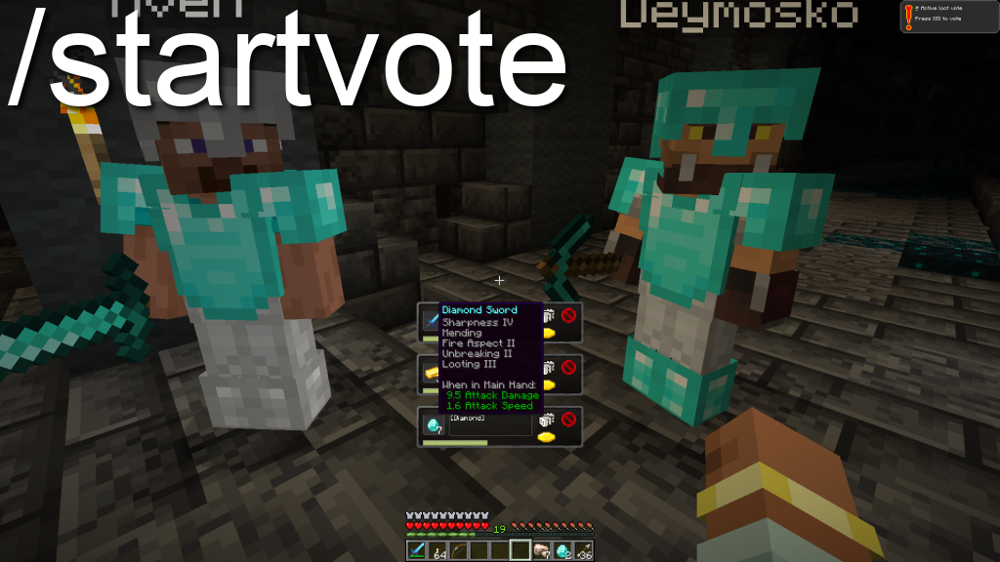

# 🎲 LootRoll

A Minecraft Forge mod (1.20.1) that adds a **Need / Greed / Pass** loot voting system inspired by classic MMORPGs like WoW or FFXIV.

---

## ✨ Features

- 🧍‍♂️ Triggered by mob deaths (configurable whitelist)
- 📦 Players vote for each dropped item separately
- ✋ Only nearby players (within 100 blocks) can vote
- ⏳ 30-second voting timer
- 🎲 Highest roller wins: Need > Greed > Pass
- 🗨️ Chat shows full roll result history
- 🖼️ GUI with buttons and progress bar
- ⚙️ Configurable entity whitelist

---

## 🌸 Configuration

Edit the config file:

`config/lootroll-common.toml`

Example:

```toml
[loot]
loot_entities = [
  "minecraft:zombie",
  "minecraft:skeleton",
  "minecraft:warden"
]
```

Only mobs listed here will trigger the loot voting system automatically.

---

## 🧑‍💻 Player Commands

### 🎲 Start a loot vote

```bash
/lootroll [amount]
```

- `amount` *(optional)* — number of items from main hand to include in the vote
- If omitted, the whole stack will be used
- If nothing is held, nothing will happen

---

### 🎲 Roll a number

```bash
/roll
```

- Rolls a random number between 1 and 100
- Result is shown in chat to nearby players(radius 100);

---

### 🎲 Roll with custom limit

```bash
/roll limit <max>
```

- Rolls a number between 1 and `<max>`
- Example: `/roll limit 500` → random number from 1 to 500
- Result is shown in chat to nearby players(radius 100);

---

### 🎲 Roll with custom range

```bash
/roll <min> <max>
```

- Rolls a number between `<min>` and `<max>`
- Example: `/roll 25 75` → random number from 25 to 75
- Result is shown in chat to nearby players(radius 100);

---

## 🖼️ Screenshots

### 🔔 ```/roll``` command


---

### 🗳️```/startvote``` command, Loot Voting UI
Each item in a vote is shown with buttons:



---

## 📦 Installation

1. Download and install [Forge 1.20.1](https://files.minecraftforge.net/net/minecraftforge/forge/)
2. Place the mod `.jar` file into your `mods/` folder
3. Launch the game

---

## 🧠 How it works

- When an entity dies:
  - Items are rolled out via the voting screen
  - All nearby players can vote (Need, Greed, Pass)
  - After 30 seconds (or once all players vote):
  - The item is assigned to the winner and dropped

---

## 💬 Localization

Supports custom language files.  
PRs for translations are welcome!

---

## ⚠️ License

MIT License – free to use, modify and distribute.

---

## 🛠️ Todo & Ideas

- [x] GUI with multiple item support
- [ ] Sound effects for votes
- [ ] Configurable voting duration
